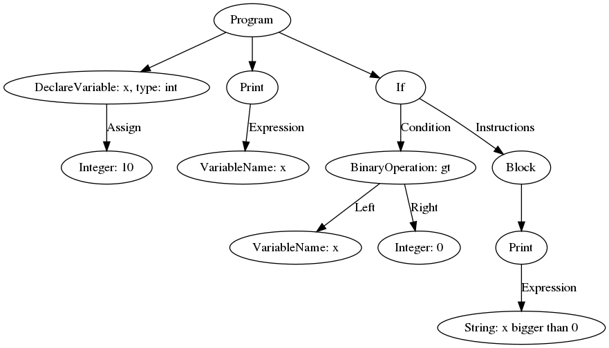

# compilers-lab

Project of compiler made during laboratories from Compilers academic course.

# Repositorium structure

* ```main.py``` - main module of compiler
* ```compiler/lexer.py``` - module for performing lexical analysis
* ```compiler/parser.py``` - module with parsing rules
* ```compiler/ast.py``` - module with declarations of classes appearing in AST with methods for code evaluation
* ```compiler/tree_printer.py``` - methods injected to classes from AST used in printing results to image file
* ```compiler/errors.py``` - definitions of custom errors used in compiler
* ```compiler/names.py``` - classes used to handle expression optimization and storage of declared variables and functions in given scope
* ```examples/``` - example codes, for some of them png files with AST are included
* ```misc/``` - miscellaneous modules made during classes: lexer for HTML, lexer translating HTML tokens to Markdown tokens and lexer for Markdown with different state for equations

# Running

1. Install requirements:
```
pip3 install -r requirements.txt
```

2. Use as an interactive console:
```
python3 main.py [-token]
```
When using -token option only token recognition is made, and identified tokens are printed. Examples are presented below.

3. Parse and execute code from file:
```
python3 main.py file_name [-ast ast_name] [-opt]
```

Options:
* ```-ast ast_name``` - prints AST to png file with given name
* ```-opt``` - perform optimizations - delete unused variables and functions, optimize using common subexpressions

# Examples

1. Token mode for interpreter
```
calc > 2
LexToken(INTEGER,2,1,0)
calc > 4.5
LexToken(REAL,4.5,1,0)
```

2. Simple calculations in interactive mode
```
calc > 2 ** 3
8
calc > j(3, 2)
0.4860912605858912
calc > sin(3.14)
0.0015926529164868282
calc > 2 > 5
False
calc > -5.67
-5.67
calc > 2 + 3; 5 + 6; 7 * 5
5
11
35
```

3. Variable declaration (warning: implicit type conversion is implemented only for calling custom-defined functions)
```calc > int x
calc > real y := 1.5
calc > boolean t := 1.0 < y
calc > string s := 'aa'
calc > print(x)
0
calc > print(y)
1.5
calc > print(t)
True
calc > print(s)
aa
```

4. Conditional expressions and loops
```
calc > int x := 10;
calc > if(x < 0) { print("x is less than 0"); } else { print("x is bigger than 0"); }
x is bigger than 0
calc > while(x > 0) { --x; }
calc > print(x)
0
calc > repeat { x++; } until(x > 10);
calc > print(x);
11
calc > for(x := 0; x < 10; x := x + 1) { print(x); }
0
1
2
3
4
5
6
7
8
9
```

5. Type conversion
```
calc > inttostr(4)
4
calc > strtoint("1234")
1234
calc > strtoreal("1.23")
1.23
calc > realtoint(1.5)
1
calc > booleantoreal(true)
1.0
```

6. Custom functions and procedures
```
calc > function multiply(int x, int y) { print("Multiplying..."); } return x * y
calc > multiply(10, 5)
Multiplying...
50
calc > procedure print_twice(real y) { print(y); print(y); }
calc > print_twice(1.5)
1.5
1.5
```

7. Drawing AST

Code:
```
int x := 10;

print(x);

if(x > 0) {
  print("x bigger than 0");
};
```

AST:

